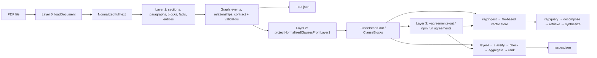

# Irving — Legal document parsing pipeline

Irving reconstructs structure and machine-readable semantics from legal PDFs (starting with SEC filings like Form 8-K). The core pipeline (Layers 0–3) is **deterministic**: no LLMs — everything is regex, heuristics, scoring, and explicit schemas so outputs are **debuggable**, **replayable**, and stable across runs. Layer 4 adds an LLM-powered agent pipeline on top of the structured output to generate a ranked issues list.

---

## Table of contents

1. [What problem this solves](#what-problem-this-solves)
2. [Quick start](#quick-start)
3. [NPM scripts](#npm-scripts)
4. [End-to-end pipeline overview](#end-to-end-pipeline-overview)
5. [Specification documents](#specification-documents)
6. [Repository layout](#repository-layout)
7. [Layer 0 — PDF text extraction](#layer-0--pdf-text-extraction)
8. [Layer 1 — Structure, graph & contract](#layer-1--structure-graph--contract)
9. [Layer 2 — ClauseBlock (semantic truth)](#layer-2--clauseblock-semantic-truth)
10. [Layer 3 — Agreement synthesis](#layer-3--agreement-synthesis)
11. [Layer 3 RAG — Storage & retrieval](#layer-3-rag--storage--retrieval)
12. [Layer 4 — Agent issues pipeline](#layer-4--agent-issues-pipeline)
13. [Core data models](#core-data-models)
13. [CLI (`analyze.ts`)](#cli-analyzets)
14. [Library API (`src/index.ts`)](#library-api-srcindexts)
15. [Logging](#logging)
16. [Testing](#testing)
17. [Design principles & limitations](#design-principles--limitations)

---

## What problem this solves

Legal PDFs are **lossy**: text order, line breaks, headers/footers, and column layout do not reliably match logical documents. Irving:

1. Pulls clean text from PDFs **per page**.
2. Segments **SEC-style** filings into **metadata**, **Item X.XX sections**, and **signature/footer**.
3. Splits section bodies into **paragraphs**, fixes **PDF line-wrap noise**, and groups paragraphs into coarse **semantic blocks** (heuristic).
4. Classifies each **atomic paragraph** for Layer 1 and attaches **typed facts** (money, percentages, dates, and more). **Semantic blocks** (within Items) are the unit that maps to **Layer 2** **ClauseBlocks** with strict **extracted_fields** and entity/event linkage.

The goal is **observable intermediate outputs** at every step so you can tune heuristics without black-box behavior. **Layer 3** builds **Agreements** on top of Layer 2 for **querying** risk and economics without replacing paragraph text.

---

## Quick start

```bash
cd irving
npm install
npm run build
```

| Goal | Command |
|------|--------|
| **Compile** TypeScript to `dist/` | `npm run build` |
| **Run full analysis** (PDF → text, structure JSON, optional Layer 2) | `npm run analyze -- <file.pdf> [options]` (alias: `npm run demo -- …`) |
| **Run the test suite** (Vitest, once) | `npm test` |
| **Layer 3 only** (read `understanding.json` → write agreements) | `npm run agreements -- --in=./out/understanding.json --out=./out/agreements.json` |
| **RAG: ingest** clauses + agreements into file-based vector store | `npm run rag:ingest -- --clauses=./out/understanding.json --agreements=./out/agreements.json` |
| **RAG: query** the indexed data with a natural-language question | `npm run rag:query -- "What are the risky clauses?"` |
| **Layer 4** — run agent issues pipeline, write `issues.json` | `npm run layer4 -- --clauses=./out/understanding.json --out=./out/issues.json` |
| **Watch mode for tests** | `npx vitest` |

### Prerequisites (RAG + Layer 4)

Both require **Ollama** running locally — no API keys needed:

```bash
brew install ollama
ollama pull nomic-embed-text   # embeddings (768-dim, ~274 MB)
ollama pull qwen2.5:7b         # LLM for queries + issue analysis (~4.7 GB)
```

Ollama starts automatically on Mac after install. If it's not running: `ollama serve`

The `.env` file at the project root sets optional overrides:

```bash
# OLLAMA_HOST=http://localhost:11434   # default
# OLLAMA_MODEL=qwen2.5:7b             # default; llama3.2 is faster but less accurate
# VECTOR_STORE_DIR=./out/vector-store  # default
```

### Full end-to-end example

```bash
# 1. Parse PDF → Layer 2 + Layer 3
npm run analyze -- ./8-K.pdf \
  --understand-out=./out/understanding.json \
  --agreements-out=./out/agreements.json \
  --preview=0

# 2. Embed + store in local vector files (./out/vector-store/)
npm run rag:ingest -- \
  --clauses=./out/understanding.json \
  --agreements=./out/agreements.json

# 3. Natural-language queries against the vector store
npm run rag:query -- "What are the risky clauses?"
npm run rag:query -- "What termination protections exist?"

# 4. Agent issues pipeline → structured issues list
npm run layer4 -- --clauses=./out/understanding.json --out=./out/issues.json
```

Run the analyzer on a PDF (prints the section tree; use `--preview=0` to skip a long text preview):

```bash
npm run analyze -- ./path/to/filing.pdf --preview=0 --flat
```

Export **all** main artifacts in one go:

```bash
npm run analyze -- ./8-K.pdf \
  --out-text=./out/extracted.txt \
  --out-json=./out/layer1.json \
  --understand-out=./out/understanding.json \
  --agreements-out=./out/agreements.json \
  --preview=0
```

- **`--out-text`** — full normalized **plain text** from the document loader.
- **`--out-json`** — **Layer 1** bundle: `entity_registry`, `block_registry`, `events`, `relationships`, and a **section tree** (`sections`) with per-paragraph `facts` / `signals` where present, `blocks`, and per-section `constraints` when applicable. This is the **graph + structure** your analyzers and validators use before Layer 2.
- **`--understand-out`** — **Layer 2**: stable JSON **array** of `ClauseBlock` objects (one row per **semantic block** in `block_registry`, not per paragraph), sorted keys, deterministic `priority` and `extracted_fields` (see [Layer 2](#layer-2--clauseblock-semantic-truth)).
- **`--agreements-out`** — **Layer 3**: JSON **array** of `Agreement` objects from `buildAgreements` (same `ClauseBlock[]` as Layer 2; no second PDF pass). You can use **without** `--understand-out` if you only want agreements on disk.

`analyze` runs **Layer 1 tree validation**, **extraction contract** checks, and **Layer 1→2 reference validation**. If any fail, it **exits with code 1** after logging issues (so CI can gate on a clean run).

**Layer 3 without re-running the PDF:** if you already have `understanding.json`, use  
`npm run agreements -- --in=./out/understanding.json --out=./out/agreements.json`  
(see [NPM scripts](#npm-scripts)). In code, `buildAgreements` and `summarizeAgreement` stay in the [library API](#library-api-srcindexts).

Paths are relative to your **current shell working directory** unless you pass absolute paths.

---

## NPM scripts

| Script | What it runs |
|--------|----------------|
| `npm run build` | `tsc` — compiles to `dist/`. Run after code changes. |
| `npm run analyze` or `npm run demo` | `tsx src/analyze.ts` — same as [CLI](#cli-analyzets). |
| `npm test` | `vitest run` — all tests, single pass, non-zero on failure. |
| `npm run agreements` | `tsx src/layer3-cli.ts` — **Layer 3** from an existing `understanding.json` (requires `--in=` and `--out=`). |
| `npm run rag:ingest` | Embed + store clauses/agreements in the local file-based vector store. Requires `--clauses=` and/or `--agreements=`. |
| `npm run rag:query` | Decompose a natural-language question, retrieve matching clauses, synthesize an answer. Pass the question as trailing args. |
| `npm run layer4` | Run the Layer 4 agent issues pipeline. Requires `--clauses=` and `--out=`. Optional `--agreement=<index>`. |
| `npx vitest` | Interactive / watch test runner. |

You can also run the CLIs directly: `npx tsx src/analyze.ts <file.pdf> …` or `npx tsx src/layer3-cli.ts --in=… --out=…`.

---

## End-to-end pipeline overview

The **default production chain** (as used by `analyze.ts`) is:



**Conceptual layers:**

| Layer | Purpose | Main entry points / artifacts |
|------|---------|--------------------------------|
| **0** | PDF → cleaned string | `loadDocument`, `createPdfParseLoader` |
| **1** | SEC Items, paragraphs, **semantic blocks**, `facts` / `signals`, **entity_registry**, **block_registry**, **events**, **relationships**, section **constraints** | `extractSections`, `splitIntoParagraphs`, `normalizeParagraphNodesAndGroupBlocks`, `buildEntityRegistry`, `buildBlockRegistry`, `buildDocumentEvents`, `buildDocumentRelationships`, `validateExtractionContract`, `validateLayer1Tree`, `validateLayer2Tree` |
| **2** | One **ClauseBlock** per Layer 1 **block**; strict `extracted_fields` | `projectNormalizedClausesFromLayer1`, `prepareLayer2ClauseForExport`, `assertLayer2ClauseBlocks` |
| **3** | **Agreement** roll-up per (issuer, counterparties) for analytics / RAG | `buildAgreements`, `computeRiskFlags`, `summarizeAgreement` |
| **3 RAG** | File-based vector store + multi-stage retrieval + query decomposition + synthesis (Ollama) | `rag:ingest`, `rag:query`, `src/rag/` |
| **4** | LLM agent pipeline: classify → check → aggregate → rank → `IssueReport` | `layer4`, `src/layer4/` |

**Optional:** `extractClauses` + `buildHierarchy` for contract-style **numbered** clauses on plain text (not required for the SEC top-level path).

**Retrieval:** treat Layer 2/3 as structured truth and use `specs/rag.md` for how chunks and summaries align.

---

## Specification documents

| File | Role |
|------|------|
| `specs/extraction_contract.md` | **Extraction completeness** — entity coverage, single block per paragraph, events, relationships, pricing. Enforced with `validateExtractionContract` + `applyExtractionContractFixes` in `analyze.ts`. |
| `specs/understanding_contract.md` | **Layer 2** — `ClauseBlock` / `ExtractedFields`, **single domain per `clause_type`**, **canonical ownership** (e.g. termination economics only on `termination` blocks), **no empty domain objects**, **fixed `PRIORITY_BY_TYPE`**, known keys only, no row-level `applies_to` on constraints. |
| `specs/rag.md` | **RAG** — how retrieval should use paragraph text vs Layer 2/3; Layer 2 = truth, Layer 3 = queryable “understanding”. |

---

## Repository layout

```
src/
├── analyze.ts                 # CLI entry: wires full pipeline + file outputs
├── index.ts                   # Public library exports
├── logging.ts                 # `legalDocLog`, `setLogLevel`
├── layer3-cli.ts              # Standalone Layer 3 CLI (understanding.json → agreements.json)
├── rag-ingest-cli.ts          # RAG ingest CLI (Layer 2 + 3 → file-based vector store)
├── rag-query-cli.ts           # RAG query CLI (natural-language question → answer)
├── layer4-cli.ts              # Layer 4 CLI (understanding.json → issues.json)
├── rag/
│   ├── db.ts                  # File paths for vector store (VECTOR_STORE_DIR)
│   ├── embed.ts               # Ollama nomic-embed-text (768-dim) via OpenAI-compatible API
│   ├── summarize-clause.ts    # `ClauseBlock` → dense plain text for embedding
│   ├── ingest.ts              # `ingestClauses`, `ingestAgreements` (upsert JSON files)
│   ├── retrieve.ts            # `retrieveClauses` (in-memory cosine + type filter + boosts)
│   ├── decompose.ts           # `decomposeQuery` — Ollama breaks question into typed sub-queries
│   └── query.ts               # `query` — orchestrates decompose → retrieve → synthesize
├── layer4/
│   ├── types.ts               # `ClauseClassification`, `ClauseIssue`, `IssueReport`, `PipelineLogEntry`
│   ├── llm.ts                 # Shared Ollama client, `chat()`, `extractJson()`
│   ├── log.ts                 # `logStep()` — prints + returns a `PipelineLogEntry`
│   ├── classify.ts            # Step 1: classify clause, determine risk_focus, decide skip
│   ├── check.ts               # Step 2: find issues in a single clause
│   ├── aggregate.ts           # Step 3: dedup + find agreement-level gaps
│   ├── rank.ts                # Step 4: deterministic sort by severity + category
│   └── pipeline.ts            # `runPipeline()` — orchestrates all four steps
├── document/
│   ├── document-loader.ts     # Interface for swappable loaders
│   ├── load-document.ts       # `loadDocument`, `setDefaultDocumentLoader`
│   └── pdf-parse-loader.ts    # pdf-parse (PDFParse) implementation
├── text/
│   ├── physical-lines.ts      # Line iterator with character offsets
│   ├── normalize-paragraph.ts # Fix soft line breaks inside paragraphs
│   ├── merge-paragraph-glue.ts
│   └── paragraph-integrity.ts
├── sec/
│   ├── extract-sections.ts    # SEC Item X.XX segmentation + header/footer
│   ├── split-paragraphs.ts    # Paragraph splitting + dense-block fallback
│   ├── entity-phrase.ts
│   ├── atomic-segmentation.ts
│   └── parse-filing-header.ts
├── semantic/
│   └── semantic-blocks.ts     # Heuristic paragraph → block grouping
├── pipeline/
│   └── enrich-segments.ts     # Normalize all paragraphs + attach blocks to sections
├── layer1/                    # Graph, events, facts, pricing model, extraction contract
│   ├── block-registry.ts
│   ├── document-events.ts
│   ├── entity-registry.ts
│   ├── relationships.ts
│   ├── section-constraints.ts
│   ├── pricing-model.ts
│   ├── extraction-contract.ts
│   ├── extraction-contract-fix.ts
│   ├── layer1-graph-compile.ts
│   ├── validate.ts
│   └── validate-layer2.ts
├── clause/
│   ├── clause.ts              # `Clause`, `ClauseType`, `SemanticBlock`, `BlockKind`
│   ├── clause-id.ts           # ID normalization, parent id, structural ids
│   ├── extract.ts             # Contract-style numbered clauses (two-pass)
│   ├── hierarchy.ts           # Nest flat clauses by numbering
│   └── print.ts               # Outline printer
└── understanding/
    ├── normalized-clause.ts   # `ClauseBlock`, `ExtractedFields`, domain sub-schemas
    ├── layer2-from-layer1.ts  # `projectNormalizedClausesFromLayer1`, `buildLayer1FilingInput`
    ├── layer2-extracted-build.ts
    ├── layer2-normalize.ts
    ├── layer2-clause-order.ts      # stable JSON key order, `prepareLayer2ClauseForExport`
    ├── layer2-field-ownership.ts   # `DOMAIN_BY_CLAUSE_TYPE`, `PRIORITY_BY_TYPE`, `applyStrictExtractedFields`
    ├── layer2-canonical-merge.ts  # single canonical `termination` economics per filing
    ├── layer3-agreement.ts        # `buildAgreements`, `computeRiskFlags`, `summarizeAgreement`
    ├── validate-layer2.ts         # `assertLayer2ClauseBlocks`, shape checks
    └── understand.ts              # Re-exports + `collectParagraphClauses`

specs/                         # Human-readable contracts (see [Specification documents](#specification-documents))
tests/                         # Additional integration tests (e.g. `layer2-schema-lock.test.ts`)
src/understanding/fixtures/   # `sample-layer1.json`, `sample-layer2.json` for tests
```

---

## Layer 0 — PDF text extraction

**Files:** `document/pdf-parse-loader.ts`, `document/load-document.ts`, `document/document-loader.ts`

### What happens

1. The PDF is read from disk and passed to **`pdf-parse`** (`PDFParse` class), which uses **pdf.js** under the hood.
2. Text is extracted **per page** via `getText()`; pages are joined with controlled spacing (no reliance on a single blob if per-page data exists).
3. **Post-processing** on the concatenated text:
   - **Repeated lines** that appear on many pages (headers/footers, running titles) are removed using a frequency heuristic (lines seen on ≥ ~45% of pages, minimum length threshold).
   - **Soft line wrapping** is partially repaired (hyphen breaks, continuation lines).
   - **Whitespace** is normalized: spaces collapsed, excessive newlines capped.

### Why it matters

Downstream regex assumes **line-oriented** SEC patterns (`Item 1.01` at line start). Garbage line breaks are reduced again later at **paragraph normalization** (Layer 1).

### Swapping implementations

`DocumentTextLoader` + `setDefaultDocumentLoader` allow replacing PDF extraction (e.g. OCR or another library) without changing callers of `loadDocument`.

---

## Layer 1 — Structure, graph & contract

`analyze.ts` does more than the segmentation steps below. After `normalizeParagraphNodesAndGroupBlocks` it **builds** `entity_registry`, per-block `pricing` models, **`block_registry`**, **`graph events`**, and **`document relationships`**, then runs `normalizeLayer1Graph` in a fixed-point loop, **`validateExtractionContract`** (with optional **`applyExtractionContractFixes`**) for `specs/extraction_contract.md`, and **`validateLayer1Tree`**, **`validateLayer1Graph`**, **`validateLayer2Tree`**. A failing contract or tree validation causes **`analyze` to exit 1** before writing outputs.

`--out-json` is the full **Layer 1** payload used for debugging and re-projection: registry + events + relationships + the enriched **section tree** (not just a bare `extractSections` result).

### 1. SEC section segmentation (`extractSections`)

**File:** `sec/extract-sections.ts`

**Goal:** Turn the full document string into top-level **segments**:

| Segment `id`   | `ClauseType` | Meaning |
|----------------|--------------|---------|
| `header`       | `metadata`   | Everything **before** the first `Item X.XX` line |
| `1.01`, `9.01` | `section`    | Body from that Item line until the next boundary |
| `signature`    | `footer`     | From footer/signature cue to EOF |

**Algorithm (two-pass):**

1. **Pass 1 — detect headers:** Walk **physical lines** (see `text/physical-lines.ts`). For each line, after trimming leading spaces, match:
   - `^Item\s+(\d+\.\d+)\s+(.*)$` (case-insensitive)
   - Capture **section number** (e.g. `1.01`) and **title** from the same line only (no title inference from following lines — avoids junk like street addresses as titles).

2. **Pass 2 — slice text:** Sort matches by start offset. Slice `[start, nextStart)` for each Item. Header is `[0, firstItemStart)`. Footer start is the **last** line at/after the last Item that matches signature/footer patterns (`SIGNATURE`, `Pursuant to the requirements of the Securities Exchange Act`, …) so cover-page noise is avoided.

**Duplicates:** If the same Item number appears twice (e.g. TOC + body), **both** boundaries are kept; paragraph IDs may repeat section ids — understanding layer dedupes by **paragraph `clause_id`** only.

---

### 2. Paragraph splitting (`splitIntoParagraphs`)

**File:** `sec/split-paragraphs.ts`

**Goal:** Split each segment’s `text` into **paragraph nodes** (`Clause` with `type: 'paragraph'`), attached as `children` of metadata / section / footer segments.

**Rules:**

- Primary split on **blank lines** (`\n\s*\n+`). Those boundaries are **preserved** (no merging across them).
- If the section is one huge block over a size threshold, **dense split** on single newlines into chunks ~1400 chars, then merge only **short** fragments from that path (explicit `\n\n` chunks are never merged together).

**IDs:** `{sectionId}.p1`, `{sectionId}.p2`, …

**Parent `text`:** The section’s full body string is **left unchanged** on the parent; children hold the split copies for indexing.

---

### 3. Paragraph text normalization (`normalizeParagraphText`)

**File:** `text/normalize-paragraph.ts`  
**Applied in:** `pipeline/enrich-segments.ts` to **every** paragraph child (and thus before block grouping and understanding).

**Goal:** Remove **PDF artifacts** inside a logical paragraph:

- Major breaks: only `\n\n` separates “real” sub-paragraphs.
- Inside each `\n\n` region: join lines with spaces; **hyphen line-break** (`word-\nnext` → `wordnext`).

This produces readable prose for retrieval without destroying deliberate blank-line structure.

---

### 4. Semantic block grouping (`groupParagraphsIntoBlocks`)

**File:** `semantic/semantic-blocks.ts`  
**Attached to:** `section` nodes only, as optional `blocks: SemanticBlock[]`.

**Goal:** Provide **coarse thematic buckets** inside an Item (overview, pricing_terms, termination, …) using **keyword scores** per paragraph. When a paragraph’s score for a **new** theme crosses a threshold vs the current block, a **new block** starts.

**IDs:** `{sectionId}.block.0`, `.block.1`, …

**Important:** Blocks **partition** the ordered paragraph list — each paragraph appears in exactly one block. Flat `section.children` remains the **ordered** list of all paragraphs for a stable global index.

---

### 5. Enrichment pipeline (`normalizeParagraphNodesAndGroupBlocks`)

**File:** `pipeline/enrich-segments.ts`

Single function that:

1. Normalizes text on **all** paragraph nodes under every top-level segment.
2. Computes **`blocks`** for each **`section`**-type segment.

This is what `analyze.ts` runs after `extractSections` + `segmentSectionsIntoParagraphs`.

---

## Layer 2 — ClauseBlock (semantic truth)

**Spec:** `specs/understanding_contract.md` (canonical field ownership, strict domain rules, no schema drift)  
**Implementation:** `understanding/normalized-clause.ts`, `layer2-from-layer1.ts`, `layer2-extracted-build.ts`, `layer2-normalize.ts`, `layer2-clause-order.ts`, `layer2-field-ownership.ts`, `layer2-canonical-merge.ts`, `validate-layer2.ts`

**Input:** A **Layer 1 filing** object: `entity_registry`, `block_registry`, `events`, `relationships`, `sections` (enriched tree).  
**Output:** A JSON **array** of **`ClauseBlock`** (alias: `NormalizedClauseRecord`) — **one row per Layer 1 semantic block** (`clause_id` === `block.id`). There are no per-paragraph understanding rows; paragraph linkage is `source_paragraph_ids`.

| Topic | Behavior |
|-------|-----------|
| **`clause_type`** | Fixed set (`structural`, `pricing_terms`, `constraint`, `termination`, `disclosure`, …). Comes from the Layer 1 **block type** mapping, not an ML classifier. |
| **`extracted_fields`** | Only the **one domain** allowed for that `clause_type` (see `DOMAIN_BY_CLAUSE_TYPE` in `layer2-field-ownership.ts`). **No** cross-domain keys; unknown keys and stray fields are stripped. **Omit** empty domain objects; use `{}` if nothing projects. **Structural** = ISO dates only (no term or USD on structural). **Constraint** rows do not use a separate `applies_to` string — scoping is at the `ClauseBlock` + relationships. |
| **Termination economics** | May appear only on **`termination`** blocks. If multiple Layer 1 termination blocks would duplicate the same economics, `mergeTerminationDomainIntoCanonical` merges into the **lexicographically smallest** `clause_id` and clears the rest. |
| **`priority`** | **Deterministic** from `PRIORITY_BY_TYPE[clause_type]` (not content-based), applied in `prepareLayer2ClauseForExport`. |
| **`confidence`** | Structured signal mix (e.g. structural is **capped ~0.6** without strong event/date enrichment — see spec). |
| **Serialization** | `prepareLayer2ClauseForExport` + `stringifyLayer2ClausesStable` produce stable key order and sorted string arrays for diffs. |
| **Validation (library)** | `assertLayer2ClauseBlocks` (throws on bad shape, duplicate termination ownership, etc.). The CLI’s **Layer 1→2** checks use `validateLayer2Tree` in `layer1/validate-layer2.ts`. |

### Output record shape (abbrev.)

```json
{
  "clause_id": "1.01.block.1",
  "clause_type": "pricing_terms",
  "source_block_id": "1.01.block.1",
  "source_paragraph_ids": ["1.01.p2", "1.01.p3"],
  "primary_entity_id": "org:…",
  "counterparty_entity_ids": ["org:…"],
  "event_ids": [],
  "event_kinds": [],
  "extracted_fields": {
    "pricing": {
      "mechanism": "vwap_discount",
      "settlement_method": "VWAP",
      "discount_rate": 0.03,
      "modes": [{ "purchase_mode": "regular_purchase", "vwap_session": "full_session", "discount_rate": 0.03 }]
    }
  },
  "relationships": { "governs": [], "constrains": [], "references": [] },
  "confidence": 0.86,
  "priority": "high"
}
```

- **`projectNormalizedClausesFromLayer1`** — main projection, runs canonical merge and export prep, and internally **`assertLayer2ClauseBlocks`**.  
- **`--understand-out`** in `analyze` writes the stable string from **`stringifyLayer2ClausesStable`**.

**Fixtures for tests:** `src/understanding/fixtures/sample-layer1.json` → `sample-layer2.json` expectations and snapshots under `src/understanding/__snapshots__/` and `src/understanding/layer2-from-layer1.test.ts`.

---

## Layer 3 — Agreement synthesis

**File:** `understanding/layer3-agreement.ts`  
**From the PDF pipeline:** pass **`--agreements-out=<path>`** to `npm run analyze` to write the same output as `buildAgreements` (shares the in-memory `ClauseBlock[]` with Layer 2). **From an existing file:** `npm run agreements -- --in=./out/understanding.json --out=./out/agreements.json`. You can also import **`buildAgreements`** when building `ClauseBlock[]` in code.

| Export | Role |
|--------|------|
| `buildAgreements(clauses)` | Partitions clauses by `primary_entity_id` + **sorted, joined** `counterparty_entity_ids` (same as `groupByAgreement`), then **`buildAgreement`** per group. |
| `buildAgreement` | Produces an **`agreement_id`** (deterministic `agrm_` + short SHA-256 of member clauses), **merged** `agreement` dates (structural), **pricing** (max discount, variable-pricing flag, **conflict** if multiple pricing mechanisms or settlement methods), **constraints** (min issuance cap rate, min beneficial cap rate), **termination** (aggregated from `termination` blocks only: max for ceilings/terms, min for notice), **disclosure** (max amounts), **`metadata.conflicts`**, and **`risk_flags`**. |
| `computeRiskFlags(agreement)` | Deterministic rules (e.g. discount ≥ 3%, short notice, large notional, low mean confidence, pricing/contract **conflict** from merge). |
| `summarizeAgreement(agreement)` | Single **plain-text** blurb for embeddings or retrieval meta-chunks. |

**Tests:** `src/understanding/layer3-agreement.test.ts` (merging, split groups, pricing conflict, risk codes).

**Contract:** There is no separate `specs/layer3` file yet; behavior is defined in code and the tests above. Layer 2 **ClauseBlock** remains the **source of truth**; Layer 3 is a **read model** for search and policy questions (see `specs/rag.md`).

---

## Layer 3 RAG — Storage & retrieval

**Files:** `src/rag/` (7 modules), `src/rag-ingest-cli.ts`, `src/rag-query-cli.ts`  
**Spec:** `specs/rag.md`  
**Requires:** Ollama running locally (see [Prerequisites](#prerequisites-rag--layer-4))

Turns the deterministic Layer 2/3 outputs into a queryable system. Everything runs locally — no database server, no API keys.

### Step 6: Storage

Embeddings and metadata are stored as JSON files under `./out/vector-store/` (configurable via `VECTOR_STORE_DIR`):

| File | Contents |
|------|----------|
| `clauses.json` | One record per `ClauseBlock`: clause_type, priority, confidence, plain-text summary, cross_reference_count, 768-dim embedding |
| `agreements.json` | One record per `Agreement`: risk_flag_count, plain-text summary, 768-dim embedding |

**Embeddings:** `src/rag/embed.ts` wraps Ollama's `nomic-embed-text` model (768-dim) via its OpenAI-compatible API. `src/rag/summarize-clause.ts` converts a `ClauseBlock` into dense plain text before embedding. Ingest upserts by ID so re-running after a PDF re-analysis is safe.

### Step 7: Retrieval

`src/rag/retrieve.ts` loads the JSON files into memory and scores each clause:

```
score = cosine_similarity(query_embedding, clause_embedding)
      + priority_boost   (high → +0.10, medium → +0.03)
      + cross_ref_boost  (min(cross_reference_count × 0.05, 0.15))
```

Optionally filtered by `clauseTypes` before scoring. Separate `retrieveAgreements` does pure cosine search on the agreements file. For the scale of a single filing (dozens of clauses), in-memory scan is instant.

### Step 8: Query decomposition (agent-lite)

`src/rag/decompose.ts` sends the user question to the local Ollama model with a structured prompt that returns a JSON array of sub-queries, each with:

- `question` — a focused retrieval question
- `clauseTypes` — which clause types to filter on
- `riskFocuses` — which risk flag codes are relevant

Example: `"Find issues"` decomposes into ~4 sub-queries targeting termination, pricing dilution, ownership protections, and missing constraints. Each sub-query runs its own targeted retrieval call, and the results are synthesized in a single Ollama chat call.

### Ingest CLI

```bash
npm run rag:ingest -- --clauses=./out/understanding.json --agreements=./out/agreements.json
```

- `--clauses=<path>` — JSON array of `ClauseBlock` (Layer 2 output)
- `--agreements=<path>` — JSON array of `Agreement` (Layer 3 output)

Both are optional but at least one must be provided.

### Query CLI

```bash
npm run rag:query -- "What are the risky clauses?"
npm run rag:query -- "What termination protections exist?"
```

Stderr shows the decomposition (sub-queries + hit counts) and token usage; stdout is the synthesized answer.

---

## Layer 4 — Agent issues pipeline

**Files:** `src/layer4/` (7 modules), `src/layer4-cli.ts`  
**Requires:** Ollama running locally (see [Prerequisites](#prerequisites-rag--layer-4))

Reads Layer 2 `ClauseBlock[]` and a Layer 3 `Agreement`, runs each clause through a four-step LLM pipeline, and writes a ranked `IssueReport` to disk.

### Pipeline steps

```
for each clause:
  Step 1 — classify   decide what risks to look for; skip empty structural clauses
  Step 2 — check      find specific issues in the clause

once across all clauses:
  Step 3 — aggregate  dedup + ask the LLM what important clause types are entirely absent
  Step 4 — rank       deterministic sort: critical → high → medium → low, then by category
```

Every step logs its clause_id, duration, and result to stderr so the run is fully observable.

### Issue output shape

```json
{
  "issue": "No termination for convenience",
  "clause_id": "1.01.block.3",
  "clause_type": "termination",
  "severity": "high",
  "reason": "Company cannot exit the agreement without cause.",
  "recommendation": "Add a termination for convenience clause with reasonable notice.",
  "category": "missing_protection"
}
```

`severity`: `critical` | `high` | `medium` | `low`  
`category`: `missing_protection` | `risky_term` | `inconsistency` | `vague_language` | `asymmetric_obligation` | `other`

### Full report shape

```json
{
  "agreement_id": "agrm_...",
  "clause_count": 7,
  "total_issues": 9,
  "critical": 0, "high": 4, "medium": 3, "low": 2,
  "issues": [ ... ],
  "log": [
    { "step": "classify", "clause_id": "1.01.block.1", "duration_ms": 312, "result": "focus: discount terms, variable pricing" },
    { "step": "check",    "clause_id": "1.01.block.1", "duration_ms": 841, "result": "2 issue(s)" },
    ...
  ]
}
```

### Design decisions

- **Sequential per clause** — Ollama doesn't benefit from parallel LLM requests; sequential also makes the log readable.
- **`quickSkip` before classify LLM call** — structural clauses with no extracted fields and `other`-typed clauses are skipped without a model call.
- **All LLM responses validated** — severity and category are range-checked; malformed JSON falls back to `[]` so a bad response never crashes the run.
- **Step 3 is the only cross-clause LLM call** — it sees the full list of clause types present and finds what's entirely absent (e.g. no governing law, no limitation of liability).
- **Step 4 is pure code** — ranking is deterministic so reruns produce stable output.

### CLI

```bash
npm run layer4 -- --clauses=./out/understanding.json --out=./out/issues.json
# analyze the second agreement in the file (default is 0)
npm run layer4 -- --clauses=./out/understanding.json --out=./out/issues.json --agreement=1
```

Flags:
- `--clauses=<path>` — Layer 2 `understanding.json`
- `--out=<path>` — where to write `issues.json`
- `--agreement=<index>` — which agreement to analyze (default: `0`, the first)

The CLI prints a summary to stderr after completion:

```
[layer4] done — 9 issue(s) → /path/to/issues.json
  critical: 0  high: 4  medium: 3  low: 2

Top issues:
  [HIGH] Short termination notice period (1.01.block.3)
  [HIGH] Broad exchange issuance cap (1.01.block.2)
  ...
```

---

## Core data models

### `Clause` (structural tree)

Defined in `clause/clause.ts`:

- **`ClauseType`:** `metadata` | `section` | `paragraph` | `footer`
- **`children`:** nested `Clause[]`
- **`blocks`:** optional on `section` — semantic grouping of paragraphs

### `SemanticBlock`

- **`id`**, **`type`** (`BlockKind`: overview, definitions, pricing_terms, …), **`children`:** paragraph clauses in order.

### `ClauseBlock` (Layer 2) — `NormalizedClauseRecord` (alias)

See `understanding/normalized-clause.ts` and `specs/understanding_contract.md`. One object per Layer 1 **semantic block**; **`extracted_fields`** is **one domain** per `clause_type` (see `applyStrictExtractedFields` / `DOMAIN_BY_CLAUSE_TYPE`).

### `Agreement` (Layer 3)

See `understanding/layer3-agreement.ts`. One **synthesized** object per **(primary_entity_id, counterparty set)** after `buildAgreements`. Not a replacement for Layer 2 — it aggregates **ClauseBlocks** for analytics and RAG.

### `ClauseIssue` and `IssueReport` (Layer 4)

See `layer4/types.ts`. `ClauseIssue` is the unit of output from the agent pipeline — one issue per identified problem, with `clause_id`, `severity`, `reason`, `recommendation`, and `category`. `IssueReport` wraps the full ranked list, per-severity counts, and the pipeline execution log.

### `Layer1GraphPayload` and validation

The JSON from `--out-json` matches the `analyze` in-memory graph shape: **`entity_registry`**, **`block_registry`**, **`events`**, **`relationships`**, **`sections`**. It is not the minimal `extractSections` output; it is **post-entity, post-facts, post-block-registry**.

---

## CLI (`analyze.ts`)

| Flag | Effect |
|------|--------|
| `--out-text=<path>` | Write full **normalized** extracted text. |
| `--out-json=<path>` | Write **Layer 1** graph JSON: `entity_registry`, `block_registry`, `events`, `relationships`, **`sections`** (tree with `facts` / `signals` / `blocks` / `constraints` as built in `analyze.ts`). |
| `--understand-out=<path>` | Write **Layer 2** JSON **array** of `ClauseBlock` (stable stringification). |
| `--agreements-out=<path>` | Write **Layer 3** JSON **array** of `Agreement` (`buildAgreements`). |
| `--preview=<n>` | Print first *n* chars of raw text to stdout; `0` skips. **Default 1200** if omitted. |
| `--flat` | Print a **segment summary** (type, id, title, `text` length) after the tree. |
| `--debug` | More verbose `legal-doc:*` logging. |

**Exit code:** `1` if **any** of: Layer 1 tree validation, Layer 1 graph validation, **extraction contract** (after auto-fix pass), or **Layer 1→2 reference validation** fails. Otherwise `0`. Successful execution does **not** require `--out-json` or `--understand-out` — the pipeline still runs validations before writing.

---

## Library API (`src/index.ts`)

Build `dist/` first (`npm run build`), then import from `irving` or from `./dist/...` when running in-repo.

**Pipeline + Layer 2 + Layer 3 example:**

```ts
import {
  loadDocument,
  extractSections,
  segmentSectionsIntoParagraphs,
  normalizeParagraphNodesAndGroupBlocks,
  buildLayer1FilingInput,
  projectNormalizedClausesFromLayer1,
  buildAgreements,
  summarizeAgreement,
} from 'irving'; // or from dist/ after `npm run build`
// … build entity_registry, block_registry, events, relationships
//   exactly as in analyze.ts (or parse --out-json from disk)
const filing = buildLayer1FilingInput({
  entity_registry,
  block_registry,
  events,
  relationships,
  sections,
});
const clauseBlocks = projectNormalizedClausesFromLayer1(filing);
const agreements = buildAgreements(clauseBlocks);
for (const a of agreements) {
  console.log(summarizeAgreement(a));
}
```

**Layer 2 only** (filing object already in memory): `buildLayer1FilingInput` + `projectNormalizedClausesFromLayer1` + optional `assertLayer2ClauseBlocks` / `stringifyLayer2ClausesStable` (see `understanding/index.ts` for `prepareLayer2ClauseForExport`, `applyStrictExtractedFields`, `mergeTerminationDomainIntoCanonical`, etc.).

**Lower-level** — `extractClauses`, `buildHierarchy`, `groupParagraphsIntoBlocks`, `validateExtractionContract`, `buildDocumentEvents`, and the rest of `src/index.ts` for experiments, tests, and custom build scripts.

---

## Logging

`logging.ts` exposes `legalDocLog` (`debug` | `info` | `warn` | `error`) and `setLogLevel`. Section detection, paragraph counts, block grouping, and understanding steps emit structured messages for troubleshooting.

---

## Testing

**One-shot (CI, default):**

```bash
npm test
```

This runs `vitest run` — all tests, single pass, **exit code 1** on any failure (same family of checks you want before merging).

**Watch / interactive** (local iteration):

```bash
npx vitest
```

**What is covered (non-exhaustive):**

- `src/**/*.test.ts` — **Vitest** picks up tests here (e.g. `text/`, `sec/`, `clause/`, `understanding/`, `semantic/`, `layer1/`).  
- `tests/*.test.ts` — e.g. `tests/layer2-schema-lock.test.ts` for projection + `DOMAIN_BY_CLAUSE_TYPE` invariants.  
- **Snapshots:** `src/understanding/__snapshots__/layer2-from-layer1.test.ts.snap` for Layer 2 projection drift.  
- **Fixtures:** `src/understanding/fixtures/sample-layer1.json`, `sample-layer2.json`.

**Developers** — after changing **Layer 2** projection output, update snapshots deliberately:

```bash
npx vitest run src/understanding/layer2-from-layer1.test.ts -u
```

---

## Design principles & limitations

**Principles**

- **Determinism** — same PDF + same code ⇒ same outputs.
- **Debuggability** — log and inspect every stage; no hidden state.
- **Modularity** — swap PDF loader, add doc types, tighten regex without rewriting the whole stack.

**Limitations**

- **Not legal advice** — heuristics miss edge cases; confidence is internal, not calibrated like a model score.
- **SEC-first** — Item segmentation targets 8-K-style headings; private credit agreements may need different `extractSections`-style drivers.
- **PDF quality** — scanned PDFs without text layers need a different Layer 0 (OCR), not included here.
- **Understanding and synthesis** — Layer 2/3 are **rule-based, schema-bound**; use as structured features, audit trails, and **retrieval keys**, not a substitute for counsel. Layer 3 is a **read model** — it can differ from a lawyer’s “one agreement” mental model if grouping keys or merge rules are wrong for a deal type.

---

## Future directions

- **Layer 4 improvements** — parallel clause analysis once Ollama supports concurrent requests reliably; per-issue `source_text` snippets linking back to the original PDF paragraphs; a confidence score on each issue.
- **Multi-document** — ingest multiple filings, filter RAG retrieval and Layer 4 analysis by `primary_entity_id` or filing date range.
- Nested **contract clause** parsing inside each Item body (`extractClauses` + hierarchy) where Items contain long, numbered agreements.
- Additional **document profiles** (credit agreement, merger agreement) with dedicated segmenters.
- **RAG improvements** — re-ranking with a cross-encoder; switching to a proper vector DB (LanceDB or Qdrant) when corpus size grows beyond a single filing.

---

## License

ISC (see `package.json`).
