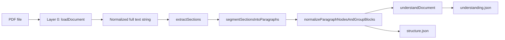

# Irving — Legal document parsing pipeline

Irving reconstructs structure and machine-readable semantics from legal PDFs (starting with SEC filings like Form 8-K). The system is **deterministic**: no LLMs in the core pipeline. Everything is regex, heuristics, scoring, and explicit schemas so outputs are **debuggable**, **replayable**, and suitable as input for embeddings, retrieval, rule engines, or downstream LLMs.

---

## Table of contents

1. [What problem this solves](#what-problem-this-solves)
2. [Quick start](#quick-start)
3. [End-to-end pipeline overview](#end-to-end-pipeline-overview)
4. [Repository layout](#repository-layout)
5. [Layer 0 — PDF text extraction](#layer-0--pdf-text-extraction)
6. [Layer 1 — Structure & segmentation](#layer-1--structure--segmentation)
7. [Layer 2 — Clause understanding](#layer-2--clause-understanding)
8. [Core data models](#core-data-models)
9. [CLI (`analyze.ts`)](#cli-analyzets)
10. [Library API (`src/index.ts`)](#library-api-srcindexts)
11. [Logging](#logging)
12. [Testing](#testing)
13. [Design principles & limitations](#design-principles--limitations)

---

## What problem this solves

Legal PDFs are **lossy**: text order, line breaks, headers/footers, and column layout do not reliably match logical documents. Irving:

1. Pulls clean text from PDFs **per page**.
2. Segments **SEC-style** filings into **metadata**, **Item X.XX sections**, and **signature/footer**.
3. Splits section bodies into **paragraphs**, fixes **PDF line-wrap noise**, and groups paragraphs into coarse **semantic blocks** (heuristic).
4. Classifies each **atomic paragraph** into a **strict legal clause type** and extracts **typed fields** (money, percentages, dates, symbolic formulas) plus **normalized entities**.

The goal is **observable intermediate outputs** at every step so you can tune heuristics without black-box behavior.

---

## Quick start

```bash
cd irving
npm install
npm run build
```

Run the analyzer on a PDF:

```bash
npm run analyze -- ./path/to/filing.pdf --preview=0 --flat
```

Export artifacts:

```bash
npm run analyze -- ./8-K.pdf \
  --out-text=./out/extracted.txt \
  --out-json=./out/structure.json \
  --understand-out=./out/understanding.json \
  --preview=0
```

- **`--out-text`** — full normalized plain text from the PDF loader.
- **`--out-json`** — nested **section tree** (metadata, Items, footer) with paragraph **children** and optional **semantic blocks**.
- **`--understand-out`** — JSON **array** of one record per paragraph `clause_id` (clause understanding layer).

Paths are relative to your **current shell directory** unless you pass absolute paths.

---

## End-to-end pipeline overview

The **default production chain** (as used by `analyze.ts`) is:



**Conceptual layers:**

| Layer | Purpose | Main entry points |
|------|---------|-------------------|
| **0** | Raw PDF → cleaned string | `loadDocument`, `createPdfParseLoader` |
| **1** | Segments, paragraphs, cleanup, blocks | `extractSections`, `splitIntoParagraphs`, `normalizeParagraphText`, `groupParagraphsIntoBlocks`, `normalizeParagraphNodesAndGroupBlocks` |
| **2** | Per-paragraph type + structured fields | `understandDocument`, `understandAtomicClause` |

**Contract clause path** (general agreements, not SEC Items): `extractClauses` + `buildHierarchy` operate on plain text and produce numbered clause trees — useful for future nested parsing **inside** a section body; the main SEC pipeline does not require them for top-level segmentation.

---

## Repository layout

```
src/
├── analyze.ts                 # CLI entry: wires full pipeline + file outputs
├── index.ts                   # Public library exports
├── logging.ts                 # `legalDocLog`, `setLogLevel`
├── document/
│   ├── document-loader.ts     # Interface for swappable loaders
│   ├── load-document.ts       # `loadDocument`, `setDefaultDocumentLoader`
│   └── pdf-parse-loader.ts    # pdf-parse (PDFParse) implementation
├── text/
│   ├── physical-lines.ts      # Line iterator with character offsets
│   └── normalize-paragraph.ts   # Fix soft line breaks inside paragraphs
├── sec/
│   ├── extract-sections.ts    # SEC Item X.XX segmentation + header/footer
│   └── split-paragraphs.ts    # Paragraph splitting + dense-block fallback
├── semantic/
│   └── semantic-blocks.ts     # Heuristic paragraph → block grouping
├── pipeline/
│   └── enrich-segments.ts     # Normalize all paragraphs + attach blocks to sections
├── clause/
│   ├── clause.ts              # `Clause`, `ClauseType`, `SemanticBlock`, `BlockKind`
│   ├── clause-id.ts           # ID normalization, parent id, structural ids
│   ├── extract.ts             # Contract-style numbered clauses (two-pass)
│   ├── hierarchy.ts           # Nest flat clauses by numbering
│   └── print.ts               # Outline printer
└── understanding/
    ├── types.ts               # `LegalClauseType`, `ClauseUnderstandingRecord`
    ├── classifier.ts          # Dominant clause type scoring
    ├── extract-fields.ts      # Schema-driven extraction per type
    ├── normalize-values.ts    # USD, %, ISO-ish dates
    ├── entities.ts            # Raw party / instrument cues from text
    ├── entity-resolution.ts   # Canonical instrument names, dedupe
    ├── primary-intent.ts      # Deterministic intent slug
    ├── confidence.ts          # Blended confidence score
    └── understand.ts          # `understandDocument`, `understandAtomicClause`
```

---

## Layer 0 — PDF text extraction

**Files:** `document/pdf-parse-loader.ts`, `document/load-document.ts`, `document/document-loader.ts`

### What happens

1. The PDF is read from disk and passed to **`pdf-parse`** (`PDFParse` class), which uses **pdf.js** under the hood.
2. Text is extracted **per page** via `getText()`; pages are joined with controlled spacing (no reliance on a single blob if per-page data exists).
3. **Post-processing** on the concatenated text:
   - **Repeated lines** that appear on many pages (headers/footers, running titles) are removed using a frequency heuristic (lines seen on ≥ ~45% of pages, minimum length threshold).
   - **Soft line wrapping** is partially repaired (hyphen breaks, continuation lines).
   - **Whitespace** is normalized: spaces collapsed, excessive newlines capped.

### Why it matters

Downstream regex assumes **line-oriented** SEC patterns (`Item 1.01` at line start). Garbage line breaks are reduced again later at **paragraph normalization** (Layer 1).

### Swapping implementations

`DocumentTextLoader` + `setDefaultDocumentLoader` allow replacing PDF extraction (e.g. OCR or another library) without changing callers of `loadDocument`.

---

## Layer 1 — Structure & segmentation

### 1. SEC section segmentation (`extractSections`)

**File:** `sec/extract-sections.ts`

**Goal:** Turn the full document string into top-level **segments**:

| Segment `id`   | `ClauseType` | Meaning |
|----------------|--------------|---------|
| `header`       | `metadata`   | Everything **before** the first `Item X.XX` line |
| `1.01`, `9.01` | `section`    | Body from that Item line until the next boundary |
| `signature`    | `footer`     | From footer/signature cue to EOF |

**Algorithm (two-pass):**

1. **Pass 1 — detect headers:** Walk **physical lines** (see `text/physical-lines.ts`). For each line, after trimming leading spaces, match:
   - `^Item\s+(\d+\.\d+)\s+(.*)$` (case-insensitive)
   - Capture **section number** (e.g. `1.01`) and **title** from the same line only (no title inference from following lines — avoids junk like street addresses as titles).

2. **Pass 2 — slice text:** Sort matches by start offset. Slice `[start, nextStart)` for each Item. Header is `[0, firstItemStart)`. Footer start is the **last** line at/after the last Item that matches signature/footer patterns (`SIGNATURE`, `Pursuant to the requirements of the Securities Exchange Act`, …) so cover-page noise is avoided.

**Duplicates:** If the same Item number appears twice (e.g. TOC + body), **both** boundaries are kept; paragraph IDs may repeat section ids — understanding layer dedupes by **paragraph `clause_id`** only.

---

### 2. Paragraph splitting (`splitIntoParagraphs`)

**File:** `sec/split-paragraphs.ts`

**Goal:** Split each segment’s `text` into **paragraph nodes** (`Clause` with `type: 'paragraph'`), attached as `children` of metadata / section / footer segments.

**Rules:**

- Primary split on **blank lines** (`\n\s*\n+`). Those boundaries are **preserved** (no merging across them).
- If the section is one huge block over a size threshold, **dense split** on single newlines into chunks ~1400 chars, then merge only **short** fragments from that path (explicit `\n\n` chunks are never merged together).

**IDs:** `{sectionId}.p1`, `{sectionId}.p2`, …

**Parent `text`:** The section’s full body string is **left unchanged** on the parent; children hold the split copies for indexing.

---

### 3. Paragraph text normalization (`normalizeParagraphText`)

**File:** `text/normalize-paragraph.ts`  
**Applied in:** `pipeline/enrich-segments.ts` to **every** paragraph child (and thus before block grouping and understanding).

**Goal:** Remove **PDF artifacts** inside a logical paragraph:

- Major breaks: only `\n\n` separates “real” sub-paragraphs.
- Inside each `\n\n` region: join lines with spaces; **hyphen line-break** (`word-\nnext` → `wordnext`).

This produces readable prose for retrieval without destroying deliberate blank-line structure.

---

### 4. Semantic block grouping (`groupParagraphsIntoBlocks`)

**File:** `semantic/semantic-blocks.ts`  
**Attached to:** `section` nodes only, as optional `blocks: SemanticBlock[]`.

**Goal:** Provide **coarse thematic buckets** inside an Item (overview, pricing_terms, termination, …) using **keyword scores** per paragraph. When a paragraph’s score for a **new** theme crosses a threshold vs the current block, a **new block** starts.

**IDs:** `{sectionId}.block.0`, `.block.1`, …

**Important:** Blocks **partition** the ordered paragraph list — each paragraph appears in exactly one block. Flat `section.children` remains the **ordered** list of all paragraphs for a stable global index.

---

### 5. Enrichment pipeline (`normalizeParagraphNodesAndGroupBlocks`)

**File:** `pipeline/enrich-segments.ts`

Single function that:

1. Normalizes text on **all** paragraph nodes under every top-level segment.
2. Computes **`blocks`** for each **`section`**-type segment.

This is what `analyze.ts` runs after `extractSections` + `segmentSectionsIntoParagraphs`.

---

## Layer 2 — Clause understanding

**Files:** `understanding/*`

**Input:** Parsed tree with **paragraph** nodes (typically after enrichment).  
**Output:** One **`ClauseUnderstandingRecord` per unique `clause_id`** (paragraph id).

### Step 1 — Classification (`classifier.ts`)

- Each allowed **`LegalClauseType`** has a set of **regex/keyword signals** with accumulated scores.
- **`classifyDominant(text)`** returns the **single** highest-scoring type; ties break with a fixed **`TYPE_PRIORITY`** order.
- **`classificationStrength`** measures separation between first and second place (used in confidence).

Allowed primary types:  
`termination`, `indemnity`, `payment`, `confidentiality`, `obligations`, `constraints`, `pricing_terms`, `misc`.

Governance-style cues are folded into **`obligations`** signals; definitional cues into **`misc`** / other scoring as appropriate — there is **no** separate “governance” or “definitions” output label.

### Step 2 — Downgrade rule (`understand.ts`)

If blended **confidence &lt; 0.5**, the clause is forced to **`misc`** **unless** the text shows **explicit** termination, pricing, or indemnity (`hasExplicitTermination`, `hasExplicitPricingTerms`, `hasExplicitIndemnity`). This reduces noisy “obligations” classifications on boilerplate.

### Step 3 — Schema-driven extraction (`extract-fields.ts`)

For the **chosen** `clause_type` only, fill a **fixed-shape** object:

- **Money:** USD floats (dollars), arrays where multiple amounts appear.
- **Percentages:** numeric (and arrays for regulatory thresholds).
- **Dates:** ISO strings where parseable (`normalize-values.ts` + `material_dates_iso` fields where relevant).
- **Formulas / basis:** symbolic enums (`VWAP`, `volume_weighted_average`, `timing_code`, etc.) — not pasted sentences.

Unknown fields are **`null`**. The pipeline does **not** invent facts.

### Step 4 — Entities (`entities.ts` + `entity-resolution.ts`)

- **Raw extraction:** phrases like “between X and Y”, exhibit-style instrument names.
- **Resolution:** `canonicalizeInstrument` maps common patterns to **canonical** labels; parties are trimmed and **deduped** case-insensitively.

### Step 5 — Primary intent (`primary-intent.ts`)

A short **deterministic slug** (e.g. `pricing_terms.vwap`, `termination.notice_days_10`) derived from **type + key extracted fields** — not free-form narrative.

### Step 6 — Confidence (`confidence.ts`)

**`blendConfidence(fieldFillRatio, classificationStrength)`** — combines how many fields are non-null with how decisive the classifier was.

### Output record shape

```json
{
  "clause_id": "1.01.p3",
  "clause_type": "pricing_terms",
  "primary_intent": "pricing_terms.vwap",
  "extracted_fields": { ... },
  "entities": {
    "parties": ["..."],
    "instruments": ["..."]
  },
  "confidence": 0.72
}
```

**`understandDocument`** walks all paragraph nodes, **dedupes by `clause_id`**, and returns a JSON-serializable **array**.

---

## Core data models

### `Clause` (structural tree)

Defined in `clause/clause.ts`:

- **`ClauseType`:** `metadata` | `section` | `paragraph` | `footer`
- **`children`:** nested `Clause[]`
- **`blocks`:** optional on `section` — semantic grouping of paragraphs

### `SemanticBlock`

- **`id`**, **`type`** (`BlockKind`: overview, definitions, pricing_terms, …), **`children`:** paragraph clauses in order.

### `ClauseUnderstandingRecord` (Layer 2)

See `understanding/types.ts`. This is **independent** from `ClauseType` — it describes **legal semantics** of a paragraph.

---

## CLI (`analyze.ts`)

| Flag | Effect |
|------|--------|
| `--out-text=<path>` | Write full extracted text |
| `--out-json=<path>` | Write `{ sourcePath, extractedTextChars, sections }` with nested tree + blocks |
| `--understand-out=<path>` | Write JSON **array** of clause understanding records |
| `--preview=<n>` | Print first *n* chars of raw extraction; `0` skips |
| `--flat` | Print segment summary (type, id, title, body length) |
| `--debug` | More verbose `legal-doc:*` logs |

---

## Library API (`src/index.ts`)

Common imports:

```ts
import {
  loadDocument,
  extractSections,
  segmentSectionsIntoParagraphs,
  normalizeParagraphNodesAndGroupBlocks,
  understandDocument,
} from 'irving'; // or relative path to dist after build
```

Manual composition:

```ts
const text = await loadDocument('filing.pdf');
const sections = normalizeParagraphNodesAndGroupBlocks(
  segmentSectionsIntoParagraphs(extractSections(text)),
);
const intelligence = understandDocument(sections);
```

Lower-level pieces (`extractClauses`, `buildHierarchy`, `groupParagraphsIntoBlocks`, etc.) are exported for experiments and future **nested** contract parsing inside a section.

---

## Logging

`logging.ts` exposes `legalDocLog` (`debug` | `info` | `warn` | `error`) and `setLogLevel`. Section detection, paragraph counts, block grouping, and understanding steps emit structured messages for troubleshooting.

---

## Testing

```bash
npm test
```

Vitest runs tests under `src/**/*.test.ts` (normalization, SEC segmentation, semantic blocks, clause extract, understanding).

---

## Design principles & limitations

**Principles**

- **Determinism** — same PDF + same code ⇒ same outputs.
- **Debuggability** — log and inspect every stage; no hidden state.
- **Modularity** — swap PDF loader, add doc types, tighten regex without rewriting the whole stack.

**Limitations**

- **Not legal advice** — heuristics miss edge cases; confidence is internal, not calibrated like a model score.
- **SEC-first** — Item segmentation targets 8-K-style headings; private credit agreements may need different `extractSections`-style drivers.
- **PDF quality** — scanned PDFs without text layers need a different Layer 0 (OCR), not included here.
- **Understanding layer** — rule-based extraction cannot capture all nuances; use outputs as **features** for humans or LLMs, not sole source of truth.

---

## Future directions

- Nested **contract clause** parsing inside each Item body (`extractClauses` + hierarchy).
- Additional **document profiles** (credit agreement, merger agreement) with dedicated segmenters.
- Optional **embedding** or **LLM** enrichment **after** this pipeline, using `understanding.json` + paragraph text as grounded context.

---

## License

ISC (see `package.json`).
